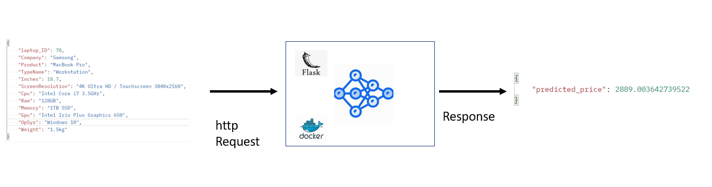
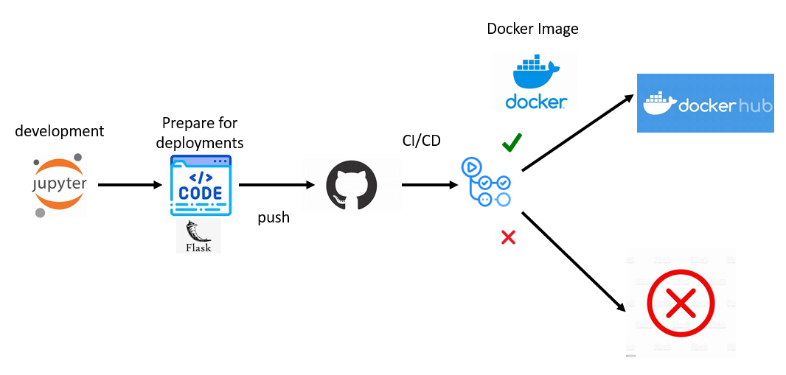

# Laptop Price Prediction API



## Description:

Machine Learning Model API Using Flask & Docker to Predict Laptop Prices based on Specs Data of Laptop, Once Running Docker Image, WSGI Server will be Running, HTTP Request Can be Send with JSON Data like below
```json
#sample
{
    "laptop_ID": 78,
    "Company": "HP",
    "Product": "",
    "TypeName": "Notebook",
    "Inches": 13.7,
    "ScreenResolution": "Full HD 3840x2160",
    "Cpu": "AMD A10-Series 9620P 2.5GHz",
    "Ram": "24GB",
    "Memory": "500GB HDD",
    "Gpu": "Intel Iris Plus Graphics 650",
    "OpSys": "Windows 10",
    "Weight": "1.5kg"
}
```
and Response will get back as the predicted value of Laptop Price 
```json
# prediction of price
{
    "predicted_price": 1715.9983530577372
}
```
if there are Invalid Data, Response will be 
```json
# example of invalid sample
{
    "error": "Invalid Data"
}
```

## Tech & Dependancies:

- Python 3.10
- Docker
- Github Actions-CI/CD Pipeline
- Knowledge About ML

## Data:

[Laptop Prices](https://www.kaggle.com/datasets/muhammetvarl/laptop-price)

## Project Development:



- After Model Developemnt and Tuning the Hyperparameters Save the Model/Pipeline as pickle file
- Create Inference Module to Transform and apply Feature Engineering to raw Data Like the Following,
```python
transformed_data["Company"] = self.json_file["Company"]
transformed_data["TypeName"] = self.json_file["TypeName"]
transformed_data["Ram"] = int(self.json_file["Ram"][:-2])
transformed_data["OpSys"] = self.json_file["OpSys"]
transformed_data["Weight"] = float(self.json_file["Weight"][:-2])
transformed_data["CPU_manufacturer"] = self.json_file["Cpu"].split()[0]
transformed_data["CPU_frequency"] = self.json_file["Cpu"].split()[-1]
transformed_data["CPU_frequency"] = transformed_data["CPU_frequency"][:-3]
transformed_data["CPU_frequency"] = float(transformed_data["CPU_frequency"])
transformed_data["CPU_model"] = self.json_file["Cpu"].split()[1:-1]
transformed_data["CPU_model"] = ''.join(val+'-' if idx != len(transformed_data["CPU_model"])-1 else val for idx, val in enumerate(transformed_data["CPU_model"]))
width_lst = int(self.json_file["ScreenResolution"].split()[-1].split(sep = "x")[0]) * 0.0264583333
height_lst = int(self.json_file["ScreenResolution"].split()[-1].split(sep = "x")[1]) * 0.0264583333
transformed_data["screen_area_cm2"] = width_lst * height_lst
transformed_data["is_4K"] = 1 if "4K Ultra HD" in self.json_file["ScreenResolution"] else 0
transformed_data["is_touchscreen"] = 1 if "Touchscreen" in self.json_file["ScreenResolution"] else 0
transformed_data["is_full_HD"] = 1 if "Full HD" in self.json_file["ScreenResolution"] else 0
transformed_data["is_Quad"] = 1 if "Quad" in self.json_file["ScreenResolution"] else 0
transformed_data["is_HD+"] = 1 if "HD+" in self.json_file["ScreenResolution"] else 0
transformed_data["is_ips_panel"] = 1 if "IPS Panel" in self.json_file["ScreenResolution"] else 0
transformed_data["is_retina_display"] = 1 if "Retina Display" in self.json_file["ScreenResolution"] else 0
transformed_data["is_ssd"] = 1 if "SSD" in self.json_file["Memory"] else 0
transformed_data["is_hdd"] = 1 if "HDD" in self.json_file["Memory"] else 0
transformed_data["is_hybrid_storage"] = 1 if "Hybrid" in self.json_file["Memory"] else 0
transformed_data["is_flash_storage"] = 1 if "Flash" in self.json_file["Memory"] else 0
transformed_data["unique_storage_types"] = transformed_data["is_ssd"] + transformed_data["is_hdd"] + transformed_data["is_hybrid_storage"] + transformed_data["is_flash_storage"]
transformed_data["total_storage"] = Inference.handle_storage_space(self.json_file["Memory"])
transformed_data["GPU_manufacturer"] = self.json_file["Gpu"].split()[0]
```
 and Predict the Laptop Price.
 - Create Data Validation Module to Validate raw data before start the transformation and prediction.
 